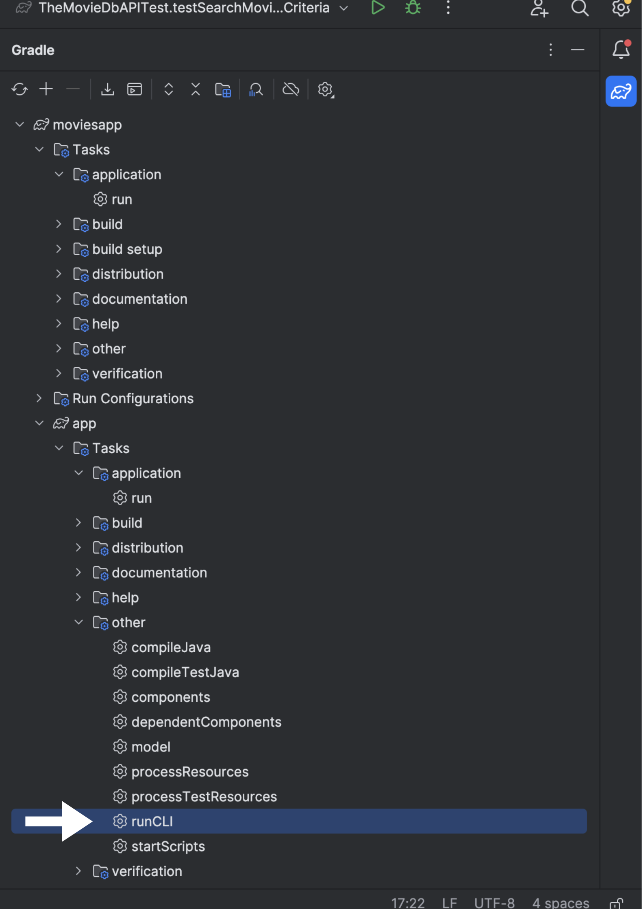
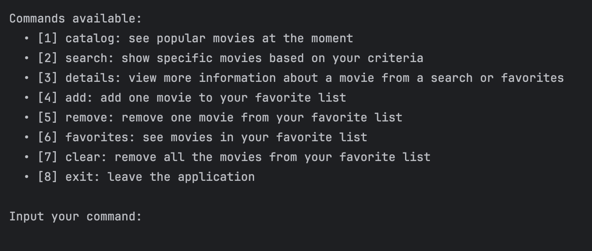
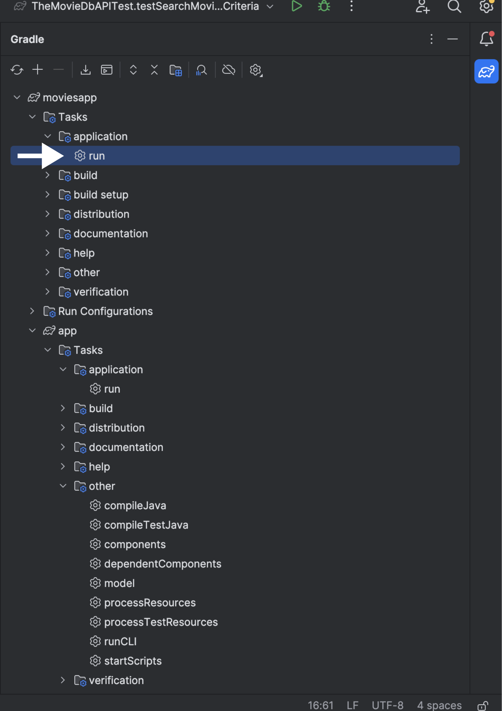
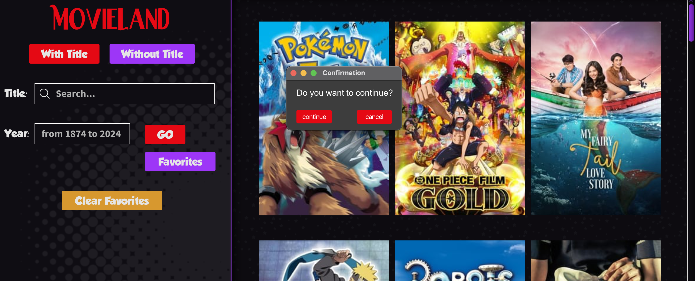
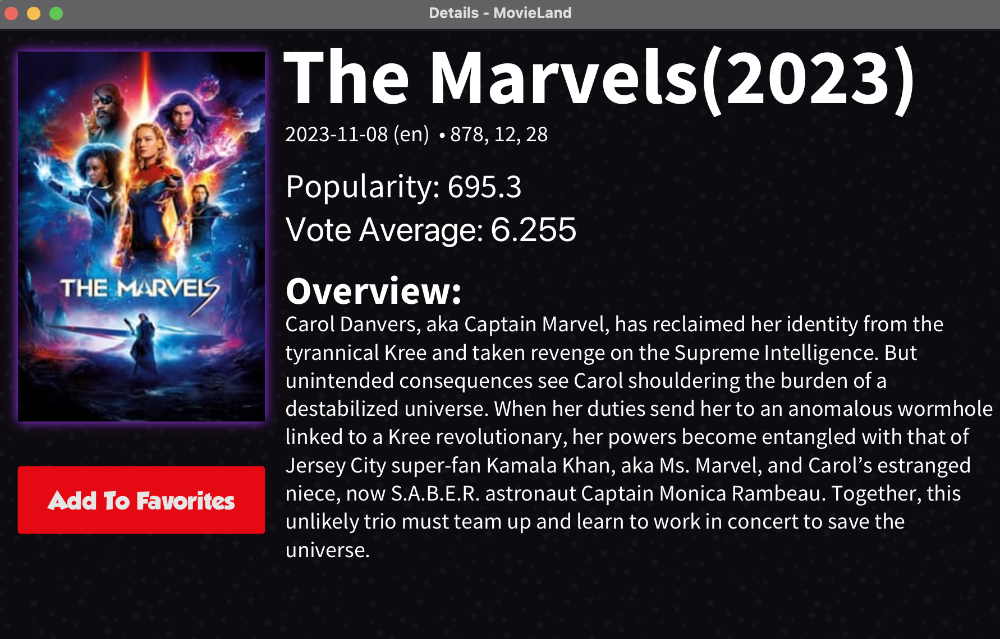
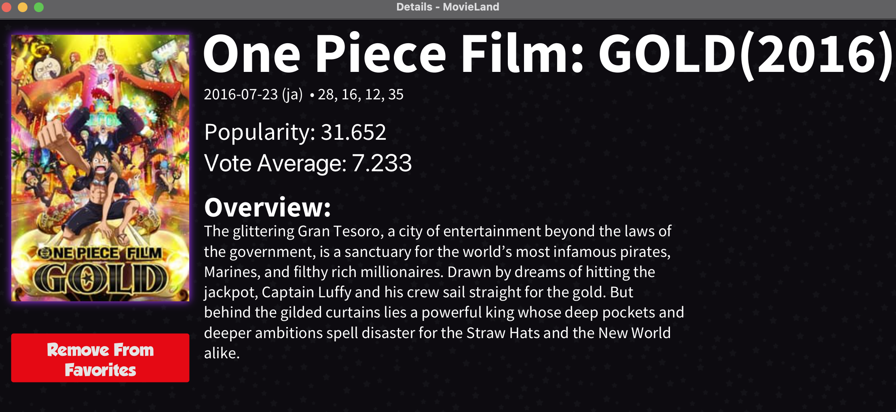
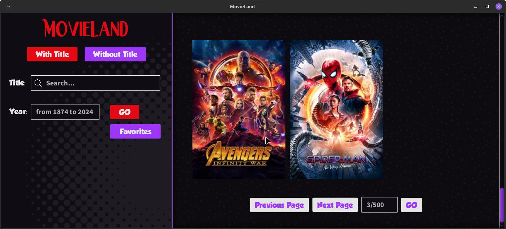

# MovieLand Application
## Useful Information
Team letter: S  
Team group: 3  
Team members: Amina FANANI, Fabien MARCUCCINI, Batiste BORG, Numa EFREMON \
Related Subject: "Software Engineering Introduction 2023-2024"  at the University of Aix-Marseille

## Overview
The MovieLand application allows its user to browse various movies and fill
its list of favorites with the films he desires. He can also discover popular films and get further details 
about any movie he is curious about. This application can be used through two different interfaces:\
    ● The Command Line Interface (CLI).\
    ● The Graphic User Interface (GUI).

### The Command Line Interface (CLI):

#### Launch Guide:
Firstly, you should click on Gradle, then click on "runCLI" situated in /moviesapp/app/tasks/others/ as shown in the picture.

#### Use Guide:
After launching the application, the terminal will display all the existing commands and their purposes and ask you to 
enter the number related to the command you chose.

After entering the number, the terminal will either display the results of your request (like for [1] catalog) or 
ask you further questions to give you personalized results.

### The Graphic User Interface (GUI):

#### Launch Guide:
Firstly, you should click on Gradle, then click on "run" situated in /moviesapp/tasks/application/ as shown in 
the picture.

#### Use Guide:
After launching the application, MovieLand should look like this: 

The right panel of the application is used to display the movies, such as the popular movies, the favorite movies 
or the movies resulting from a search. 

While the left panel contains the name of the application "MovieLand" which, if you click on it, will display the 
popular movies.

There are also two types of research: either with a title or without one, which gives the user 
the liberty to use the one he prefers. If you choose the "Without Title" version and you want to choose two or more
genres, then you must keep clicking on "shift" or "Cmd" if you are on Mac or "Ctrl" if you are on Windows.
By clicking on the "Go" button, the right panel will be filled with the movies resulting from his search.

This application allows the user to have a list of favorite movies, if he clicks on "Favorites", all his favorite 
movies will appear in the right panel as well as the "Clear Favorites" button. This button grants the user the possibility 
to initialize his favorites, but for a security matter, a confirmation window will pop up right after clicking on
"Clear Favorites" to make sure the user truly wants to clear his favorites.

Each film has a detail section that pops up in a window when clicking on the film's picture. If the movie isn't 
added to favorites, then the "Add To Favorites" button appears in the details section :

If the movie is already added to favorites, then the "Remove From Favorites" button will appear in the details section:

At the end of the main page, the user can choose if he wants to go back to the "Previous Page" or to jump into the 
"Next Page" or to choose a specific page by entering a page number.

